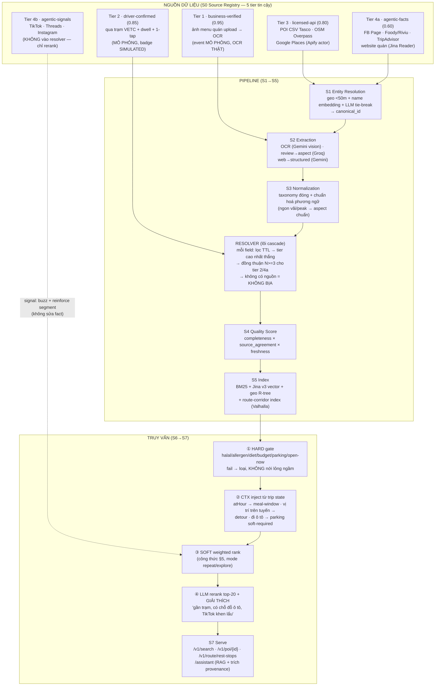

# SYSTEM FLOW — POI Enrichment & Retrieval Engine (bản nâng cấp evidence-based)

> Mở rộng trực tiếp `ENGINE_PROPOSAL.md` (kiến trúc S0–S7). Tài liệu này trả lời:
> **dữ liệu vào từ đâu (field cụ thể), trigger lúc nào, resolver chọn giá trị thế nào,
> ranking/personalization match ra sao, và output trả về gì** — toàn bộ dựa trên
> cơ chế đã được chứng minh ở Amap, Meituan, DoorDash, Uber Eats, Baidu, Grab, Trucker Path
> (dẫn nguồn ở cuối file) và trong giới hạn API/credit ta thật sự có.
>
> Cặp tài liệu: phần business (segment, tài chính, use case) ở `BUSINESS_CASE.md` cùng thư mục.

**Trạng thái:** thiết kế đã chốt qua brainstorm 11/07/2026 — cascade 5 tier, tách facts/signals,
schema 2 chiều POI ↔ driver, match HARD/CTX/SOFT, signals chỉ được *reinforce* segment
(không tự tạo). Segment chính: **B — gia đình đi ô tô liên tỉnh** (xem BUSINESS_CASE.md §2).

---

## 1. BẢN ĐỒ LUỒNG TỔNG (input → output)



Điểm mấu chốt so với proposal gốc: **S2c "web enrichment" không còn là 1 hộp mờ** — nó tách thành
tier 4a (facts, cạnh tranh trong resolver) và tier 4b (signals, chỉ phục vụ personalization),
cộng thêm 2 tier chỉ Tasco làm được (business-verified, driver-confirmed).

---

## 2. INPUT FIELDS — từng nguồn lấy đúng field gì

### Tier 3 — licensed / owned (backbone, độ phủ)

| Nguồn | Cách lấy | Field cụ thể |
|---|---|---|
| **POI CSV Tasco** (benchmark 30 quán) | load 1 lần (T1-bootstrap) | `poi_id, name, address, city, lat, lon, cuisine_type, price_range, opening_hours, phone, rating, poi_quality_score, known_strengths, known_weaknesses, amenities_raw, recommended_segments` (+ các cột còn lại trong 21 cột) |
| **OSM Overpass** (free, ODbL) | query `amenity=restaurant` quanh bbox | `name, lat, lon, cuisine, opening_hours, phone, website, addr:*, wheelchair` |
| **Google Places qua Apify** ([compass/crawler-google-places](https://apify.com/compass/crawler-google-places), ~$1.5–4/1k places, **có credit**) | actor run theo danh sách tên+địa chỉ | `title, address, location{lat,lng}, categoryName, totalScore, reviewsCount, openingHours[], popularTimesHistogram, price, website, phone, reviews[], imageUrls[], additionalInfo` (trong đó có **Parking**, Family-friendly, Payments) |
| **Tasco Valhalla/Pelias** (production, THẬT) | `/route` 2 lần (baseline vs qua POI) · `/geocode` | `detour_seconds, detour_km, polyline, snapped_coords` — **field tính toán, không nguồn nào khác có** |

### Tier 4a — agentic-facts (điền chỗ trống, confidence 0.60, cần đồng thuận để thắng tier 3)

| Nguồn | Tool (credit ta có) | Field |
|---|---|---|
| **Facebook Page quán** | Apify FB scraper | `hours, phone, address, menu_photos[], posts_recent[], price_range_hint` |
| **Foody / Riviu / diadiemanuong** | **TinyFish/AgentQL** (schema mỗi trang mỗi khác → hợp agentic) | `avg_price, rating, review_text[], photos[], opening_hours, amenities_text` |
| **TripAdvisor** | Apify actor | `rating, reviews_en[], cuisine_tags, price_band` — giá trị cao vì dataset nặng thành phố du lịch (Hạ Long, Đà Nẵng, Huế, Nha Trang) |
| **Website/menu PDF của quán** | Tavily (tìm URL) → Jina Reader (`r.jina.ai`) → Gemini structure | `menu_items[{dish_name, price_vnd}], dietary_hints` |

### Tier 4b — agentic-signals (KHÔNG vào resolver; nuôi personalization)

| Nguồn | Tool | Field thô → tín hiệu sau xử lý |
|---|---|---|
| **TikTok** | Apify TikTok scraper | `caption, hashtags, views, likes, created_at` → qua **pipeline phương ngữ** (§3) → `{aspect, sentiment, dish_mention, segment_hint, buzz_score, ts}` |
| **Threads / Instagram** | Apify | `caption, likes, created_at` → như trên |

### Tier 1 + 2 — chỉ Tasco có (hackathon: event MÔ PHỎNG, xử lý THẬT)

| Nguồn | Trigger | Field |
|---|---|---|
| **Quán upload ảnh menu / claim POI** | T4 (mô phỏng) | ảnh → **Module 2 OCR thật** → `menu_items[{dish_name, price_vnd, dietary_tags, ingredients}]` — tier 0.95, đè agentic |
| **Sự kiện lái xe VETC** | T5 (mô phỏng) | `passage{station_id, ts, vehicle_class}` · `dwell{poi_id, minutes}` · 1-tap confirm: `car_parking:bool, restroom_clean:1..5, kid_friendly:bool, wait_min:int` |

### Driver preference schema (đầu vào phía người dùng — gương của schema POI)

```json
{
  "stated":  { "diet": ["chay"], "allergens": ["đậu phộng"], "spice": "cay được",
               "budget_pp_vnd": 150000, "party": {"kids": 2, "elderly": 0, "size": 4} },
  "ctx":     { "atHour": 12, "route": "<polyline HN→Hạ Long>", "position_on_route": 0.4,
               "vehicle": "car", "mode": "explore" },
  "learned": { "repeat_pois": ["poi:res002"], "cuisine_affinity": {"hải sản": 0.8} }
}
```

`stated` = user khai; `ctx` = tự suy từ chuyến đi (không bao giờ hỏi); `learned` = tích luỹ
(hackathon: profile JSON tĩnh; production: consumer-memory kiểu DoorDash).

---

## 3. PIPELINE PHƯƠNG NGỮ VIỆT (điểm không ai có)

TikTok/Threads text → **(1) chuẩn hoá slang/teencode** ("ngon vãi", "peak thế", "mặn vừa miệng",
"nhậu đc", teencode mất dấu) → **(2) tách aspect** (món / giá / không gian / phục vụ / đỗ xe) →
**(3) sentiment theo aspect** → signal candidate.

- Hackathon: **Gemini Flash few-shot + lexicon slang tự curate** (1 call làm cả 3 bước, structured output).
- Production path (slide): **ViSoBERT** (pretrained trên FB/YouTube/TikTok tiếng Việt) + framework
  lexical-normalization đã publish + ABSA nhà hàng (ViGSA). Đây là bằng chứng học thuật rằng layer này build được.
- **Luật cứng:** output 4b chỉ được (a) cộng `buzz_score`, (b) **reinforce** một `recommended_segment`
  mà tier cao hơn đã gợi ý. Không bao giờ tạo segment mới, không bao giờ sửa fact.

---

## 4. TRIGGER POINTS — cái gì kích hoạt luồng nào

| # | Trigger | Điều kiện | Luồng chạy | Real/Sim |
|---|---|---|---|---|
| **T1** | Bootstrap | khởi động hệ thống | load CSV + OSM → S1 ER → index | REAL |
| **T2** | **Gap-detect** | `quality_score < 0.75` HOẶC field bắt buộc trống (menu, hours, parking) | Tavily tìm URL → route theo platform: Apify (Google/FB/TikTok/TripAdvisor) · TinyFish (Foody/Riviu) · Jina (website) → Gemini normalize → resolver → re-score | REAL (demo hero: RES019–030 nhảy 0.6→0.9 live) |
| **T3** | **TTL hết hạn** | tier 3: 30d · 4a: 14d · signals: decay theo tuần · tier 1: 180d · tier 2: 90d | re-fetch đúng nguồn đó, resolver chạy lại field đó | REAL (cơ chế), demo tua nhanh |
| **T4** | **Business event** | quán upload menu / claim | Module 2 OCR (THẬT) → candidate tier 1 → resolver đè agentic → score tăng | SIM event + REAL OCR, badge `MÔ PHỎNG` |
| **T5** | **Driver event** | xe qua trạm (geofence) + `atHour` trong khung bữa (§Module 5 đã build) HOẶC dwell ≥ 25 phút trong 150m POI | (a) push gợi ý meal-window-gated (`push:false` ngoài khung) · (b) 1-tap confirm → candidate tier 2 | SIM, badge `MÔ PHỎNG` |
| **T6** | **User query** | `/search`, `/route/rest-stops`, `/assistant` | luồng §5 | REAL |

Bằng chứng cho T5: Grab CDP dùng geofence + event trigger + predictive model, đo được
**+3% conversion** toàn SEA — đây là citation cho việc "đẩy chủ động lúc đang lái" có giá trị thương mại.
Meal-window gating có citation riêng: Baidu MST-PAC đo 17.9% user cùng một query prefix
tìm POI khác nhau theo giờ/vị trí.

---

## 5. RANKING + PERSONALIZED MATCHING (chọn lọc theo lợi thế Tasco)

Chọn đúng 4 cơ chế từ nghiên cứu — mỗi cái một lý do, bỏ phần còn lại (graph learning, user
foundation model… để slide roadmap, không build):

1. **HARD → CTX → SOFT** (thiết kế 2 chiều của ta) — vì nó chạy được bằng rule + embedding, không cần training data.
2. **Behavior rank "Bảng xếp hạng Bánh xe"** (Amap Street Stars: Tire-Wear + Repeat Customer ranking, 40M user test) — vì tín hiệu này Tasco *sở hữu* (điều hướng + VETC), Foody/Google VN không giả được.
3. **Repeat/Explore mode split** (Meituan RecSys'24: hai hành vi cần hai recommender) — vì map ra ngữ cảnh lái xe cực tự nhiên: đường đi làm = repeat, đi lễ/du lịch = explore.
4. **LLM rerank top-K kèm giải thích** (DoorDash KDD'25: ranker cổ điển lo scale, LLM lo ngữ nghĩa + explanation) — vì đã có sẵn trong S6 proposal, chỉ thêm trường `explanation`.

```
ỨNG VIÊN = S5 recall (BM25 + vector + corridor)                      # rộng
① HARD gate  : halal / allergen / dietary / budget_pp / open-now(atHour)
               / car_parking nếu vehicle=car                          # fail → loại
               → nếu RỖNG: trả lời trung thực + đề xuất nới lỏng CÓ NHÃN
                 (bẫy Halal-HCM xử lý tại đây, không phải tại LLM)
② CTX inject : atHour → meal-window · position_on_route → detour_min (Valhalla THẬT)
               · party.kids > 0 → family_facilities từ SOFT thành HARD
③ SOFT score :
   0.30 · S_semantic   (Jina v3 + reranker: query ↔ name+menu+aspects)
   0.20 · S_behavior   (Bánh-xe: dwell_repeat + detour_willingness; hackathon = SIM)
   0.20 · S_match      (khớp schema 2 chiều: spice, speed, group, view…)
   0.15 · S_route      (1 − detour_min / detour_cap)                  (THẬT, chỉ Tasco có)
   0.10 · S_quality    (S4 score — POI đáng tin được ưu tiên)
   0.05 · S_buzz       (tier 4b, decay tuần; chỉ reinforce)
   mode=repeat  → S_behavior +0.10, S_buzz −0.05 (lấy từ trọng số semantic)
   mode=explore → S_buzz +0.05, S_behavior −0.10
④ LLM rerank : top-20 → Gemini Flash structured → thứ tự cuối + explanation tiếng Việt
               ("cách tuyến 4 phút, có chỗ đỗ ô tô [nguồn: chủ quán], TikTok tuần này khen món lẩu")
```

Trọng số là default hackathon (chưa tune — nói thẳng với giám khảo). Điều quan trọng không phải
con số mà là **cấu trúc**: 0.35 tổng trọng số (`S_behavior + S_route`) đến từ tín hiệu chỉ
map/hạ tầng Tasco sinh ra được — đối thủ muốn copy công thức cũng không có input.

---

## 6. RESOLVER — luật chọn giá trị thắng cho mỗi field

```
candidates(field) = [{value, source, tier, confidence, fetched_at}, ...]
1. Loại candidate quá TTL (theo bảng T3).
2. Chọn tier cao nhất còn sống. Hoà tier → chọn fetched_at mới nhất.
3. Luật đồng thuận: tier 2 (driver) và 4a (agentic) chỉ ĐÈ tier dưới khi ≥3 nguồn/lượt
   độc lập đồng ý. 1 nguồn agentic đơn lẻ không thắng nổi API còn tươi.
4. 0 candidate sống → field VẮNG. Không suy đoán, không điền mặc định.
   (bẫy Crystal BBQ: enrichment không tìm thấy gì → not_found, demo được live)
5. Giữ TOÀN BỘ candidate list làm provenance — không chỉ giá trị thắng.
```

---

## 7. OUTPUT FLOW — contract giữ nguyên, mở rộng chỉ trong `meta`

`PlaceResult` DTO đúng API doc Tasco (không thêm field tầng ngoài). Phần mở rộng:

```json
{
  "id": "poi:res023", "type": "poi", "name": "…", "label": "…", "address": "…",
  "category": "restaurant", "coordinates": {"lat": 0, "lon": 0},
  "distanceMeters": 0, "score": 0.87, "source": "mock", "tags": ["…"],
  "meta": {
    "qualityScore": 0.91,
    "detourMinutes": 4.2,
    "behaviorRank": {"type": "tire_wear", "percentile": 92, "simulated": true},
    "matchExplanation": "Cách tuyến 4 phút; có chỗ đỗ ô tô; phù hợp gia đình có trẻ nhỏ",
    "badges": ["SIMULATED:driver-confirmed"],
    "provenance": {
      "car_parking": {"value": true, "source": "driver-confirmed", "tier": 2,
                       "confidence": 0.85, "fetched_at": "2026-07-10T12:31:00+07:00",
                       "candidates": 3}
    }
  }
}
```

Endpoint: `GET /v1/search` · `GET /v1/poi/{id}?include=…` · `GET /v1/route/rest-stops?atHour=`
(Module 5, đã chạy) · `/assistant` (RAG **bắt buộc trích nguồn theo provenance** — trả lời được
"nguồn nào?", việc AI summary của Google không làm).

**Guard xuyên suốt:** (1) dữ liệu mô phỏng tier 1/2 chỉ phục vụ demo, badge rõ, **không bao giờ**
tham gia trả lời 15 câu benchmark; (2) tiếng Việt giữ dấu ở mọi output; (3) cache-first, demo
sống khi mất mạng (pattern Module 5).

---

## 8. EVIDENCE MAP — cơ chế nào lấy từ đâu

| Cơ chế trong flow | Bằng chứng | Ta dùng ở |
|---|---|---|
| Behavior ranking từ hành vi di chuyển (Tire-Wear/Repeat) | [Amap Street Stars — SCMP](https://www.scmp.com/tech/big-tech/article/3325225/amap-alibabas-answer-google-maps-sees-over-40-million-users-test-new-ranking-service), [iChongqing](https://www.ichongqing.info/2025/09/12/alibabas-amap-launches-worlds-first-ai-driven-consumer-ranking-based-on-user-behavior/) — 40M user, 1.6M cơ sở | `S_behavior`, T5 |
| Repeat vs Explore cần 2 chế độ | [Meituan/Tsinghua RecSys'24](https://dl.acm.org/doi/10.1145/3640457.3688119) | mode switch §5 |
| Ranker cổ điển + LLM rerank/giải thích/KG | [DoorDash KDD'25](https://careersatdoordash.com/blog/doordash-kdd-llm-assisted-personalization-framework/), [DoorDash KG](https://careersatdoordash.com/blog/building-doordashs-product-knowledge-graph-with-large-language-models/) | ④ §5, S3 |
| Query đổi intent theo giờ/vị trí (17.9%) | [Baidu MST-PAC](https://openreview.net/forum?id=bood9f1ewz) | CTX meal-window |
| Geofence trigger +3% conversion | [Grab engineering](https://engineering.grab.com/) | T5 push |
| Gọi điện tự động xác minh thuộc tính POI quy mô lớn | [Baidu DuIVRS CIKM'22](https://dl.acm.org/doi/10.1145/3511808.3557131) | roadmap tier 1 (bot Zalo/phone) |
| Ranking bằng engagement map-native (directions requests) | [Apple Maps ranking factors](https://www.localseoguide.com/apple-maps-ranking-factors-2/) | `S_behavior` |
| Crowdsource 1 field wedge (parking) nuôi cả cộng đồng | [Trucker Path](https://en.wikipedia.org/wiki/Trucker_Path) — ~⅓ tài xế Bắc Mỹ dùng hàng tháng | T5 1-tap, BUSINESS_CASE §Phase 2 |
| Slang/phương ngữ VN xử lý được | [ViSoBERT](https://arxiv.org/html/2310.11166v1) · [normalization](https://arxiv.org/html/2409.20467v1) · [ViGSA ABSA nhà hàng](https://www.researchgate.net/publication/396607468_ViGSA_A_Multi-Task_Aspect-Based_Sentiment_Analysis_Model_with_Auxiliary_Embedding_and_Global_Sentiment_Integration_for_Vietnamese_Restaurant_Reviews) | §3 |
| Dish-level sentiment từ review | [Zomato Fiducia](https://arxiv.org/pdf/1903.10117), [Swiggy neural search](https://www.zenml.io/llmops-database/neural-search-and-conversational-ai-for-food-delivery-and-restaurant-discovery) | Module 3 nâng cấp |
